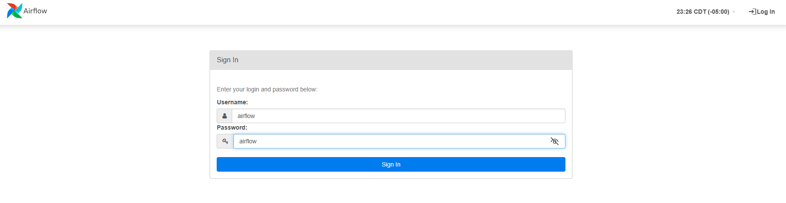
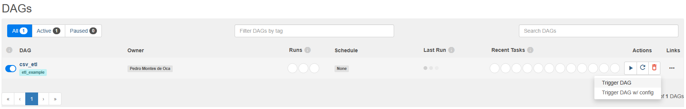
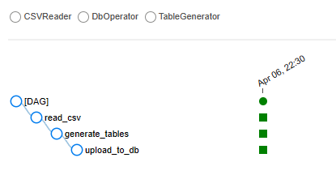
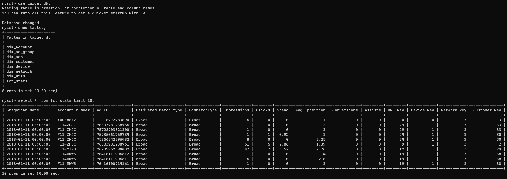

# Data Engineering Code Test

This is a simple ETL pipeline that ingests a CSV file, and exports the data to multiple tables in a MySQL database.

The repository contains a set of folders, each representing an endpoint of the 'system', one being a MySQL container, with the other containing a set of Python scripts that perform the ETL through an Airflow DAG. Additionally, it contains the docker-compose file that allows everything to run in parallel.

## MySQL

The **mysql** folder contains only a .sql file to create the target database.

At this time, everything runs under the MySQL root account.

## DAGs

The **dags** folder contains the below structure:
- data
    - This is where CSV files (that follow the original file structure) must be placed for the script to ingest them
- modules
    - In here we have the different parts of the script, each of which are explained under the **Process overview** section.

### Process Overview

The Python script is segmented in four elements:

- Data Reader
    - This script, located under the **dags** fodler, is where we declare the Airflow DAG along with ordered tasks for the process execution.
- DB Operator:
    - This script creates a connection to the MySQL database and performs the data export.
- CSV Process:
    - In here we have multiple functions that handle the ingestion of a CSV file, while generating a 'clean' dataframe.
- Table Generator:
    - Used to split the 'clean' dataframe from CSV Process into dimensional and fact tables, which are set up based on a snowflake schema.

To run this, you need to have Docker and Docker Compose installed, after that, ensure Docker is running, and from a terminal run:

```
docker-compose build
docker-compose up
```

After waiting for about a minute, you will need to access your browser, and navigate to [localhost:8081](http://localhost:8081)

When faced with the Airflow login screen, you can log in using **airflow** as both username and password.



You can now see the DAG listed on the homescreen.

To run it, click the "play" button, and click **Trigger DAG**



After a couple of seconds, the Runs will update the status to "successful".

To view more details, click on **csv_etl*.



To validate that the ETL completed successfully, you can open a terminal and run:

```
docker exec -it mysql_local mysql -u root -p
```

The password for the database is:
```
Worry3!Unissued!Operative
```

You can then run the below commands to validate that the tables were created and they contain data:
    - You need to replace {table} for any of the table names shown after **show tables**.

```
use target_db;
show tables;
select * from {table} limit 10;
```

